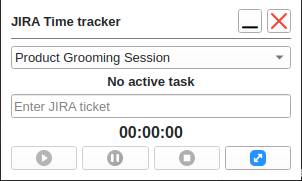
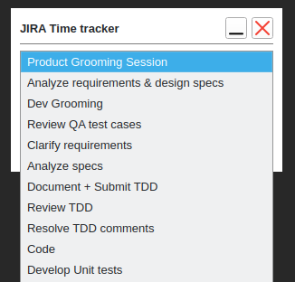
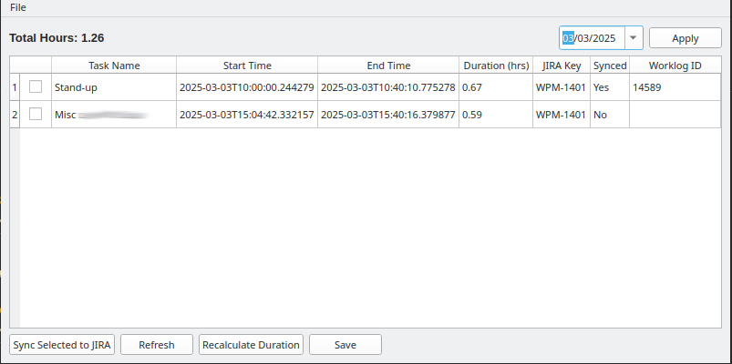
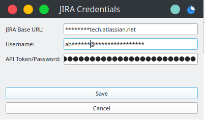
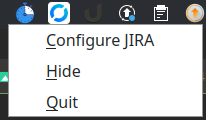

# Time Tracker

A desktop application for tracking time spent on tasks with Jira integration. Built with Python and PyQt6.

## Features

- Track time spent on tasks
- Log tracked time to Jira tickets
- Local database to store all the tracking information (timetracker.db)
- Pause and resume tasks
- Minimalistic UI with system tray support
- Cross-platform support (Windows, Linux, macOS)
- Has reminder notifications (every minute) (TODO: Configure)
- Activity tracking to inform user about inactivity (TODO: Implement)

## App Overview

The application provides several key interfaces for time tracking and Jira integration:

### Time Tracker Widget


A compact widget interface featuring:
- Task selection dropdown
- JIRA ticket input field
- Timer display
- Play/pause/stop controls
- Timer cannot be started if the task is not selected and JIRA ticket is not provided
- Reminder notifications are shown if the timer is running for more than 15 minutes
- Reminder notifications every minute if timer is not started for any task

### Task Selection Menu


Predefined task categories including:
- Product Grooming Session
- Development tasks
- QA review activities
- Documentation tasks
- Code and testing activities

### Main Time Tracking Window


The main window displays:
- A list of tracked tasks with start/end times
- Total hours tracked for the selected period
- JIRA ticket references and sync status
- Controls for syncing, refreshing, and saving entries

### JIRA Configuration


A settings dialog for JIRA integration:
- JIRA Base URL configuration
- Username/email input
- API token/password management
- Save/cancel options

### System Tray Integration


System tray features:
- Quick access to JIRA configuration
- Option to hide/show the application
- Application quit function
## Prerequisites

- Python 3.10 or higher
- pip (Python package installer)
- Git

## Development Setup

### Clone the repository:

```bash
git clone https://github.com/yourusername/time-tracker.git
cd time-tracker
```

### Create and activate a virtual environment:

#### **Windows:**

```bash
python -m venv venv
venv\Scripts\activate
```

#### **Linux/macOS:**

```bash
python3 -m venv venv
source venv/bin/activate
```

### Install dependencies:

```bash
pip install -r requirements.txt
```

### Generate Jira API Token:

- Visit [Atlassian API Tokens](https://id.atlassian.com/manage-profile/security/api-tokens)
- Click "Create API Token"
- Give it a meaningful label
- Copy the generated token

## Running the Application

### From the project directory, run:

```bash
python main.py
```

### `.env` file will be created automatically with the provided credentials

```
JIRA_SERVER=https://your-domain.atlassian.net
JIRA_EMAIL=your-email@example.com
JIRA_API_TOKEN=your-api-token
```

## Building the Application

### Windows

```bash
python setup.py build
```

The executable will be created in the `dist` directory.

### Linux

```bash
python setup.py build
```

The executable will be created in the `dist` directory.

### MacOS

```bash
python setup.py build
```

The executable will be created in the `dist` directory.

## Project structure

```
time_tracker/
├── gui/ # GUI components
├── static/ # Static files (icons, etc.)
├── logs/ # Log files
├── dist/ # Build output
├── .env # Environment variables
├── .env.example # Environment variables example
├── .gitignore # Git ignore rules
├── .isort.cfg # isort configuration
├── activity_tracker.py # Activity tracker
├── alchemy.py # Database operations
├── jira_integration.py # Jira integration logic
├── logging_setup.py # Logging configuration
├── main.py # Main application entry point
├── notification.py # Notification handling
├── reminder_tracker.py # Reminder system
├── setup.py # Build script
├── tasks_new.json # Sample tasks data
├── time_tracking.py # Time tracking logic
├── utils.py # Utility functions
├── requirements.txt # Project dependencies
└── README.md # Project documentation
```

## Environment Variables

| Variable | Description |
|----------|-------------|
| JIRA_SERVER | Your Atlassian domain URL |
| JIRA_EMAIL | Your Atlassian account email |
| JIRA_API_TOKEN | Your Atlassian API token |

## Notes

- The Jira API token has an expiration date. Make sure to update it before it expires.
- Keep your API token secure and never commit it to version control.
- For Linux users: The application requires `dbus-python` which should be installed via your system's package manager if pip installation fails.

## Troubleshooting

### Linux Dependencies

If you encounter issues with dbus-python, install system dependencies:

**Ubuntu/Debian:**

```bash
sudo apt install python3-dbus
```
